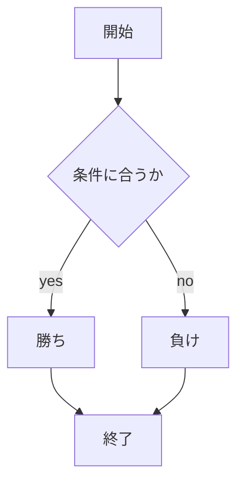

# webpro_06

## このプログラムについて

## app5.jsについて

### hello1について
このプログラムはHello worldとBon jourの挨拶をshow.ejsに表示させます

### hello2について
hello1と機能はほとんど同じだがメッセージは直接関数内に渡されます

### iconについて
このプログラムはアイコンの画像ファイルを表示させます

## ファイル一覧

ファイル名|説明
-|-
app5.js|プログラム本体
public/janken.html|じゃんけんの開始画面
views/janken.ejs|じゃんけんのテンプレートファイル
views/atti.ejs|あっち向いてホイのテンプレートファイル
views/yubisuma.ejs|指スマのテンプレートファイル


```javascript
console.log( 'Hello' );
```



## 使用方法

### じゃんけん
1. app5.js を起動する
1. Webブラウザでlocalhost:8080/public/janken.htmlにアクセスする
1. 自分の手を入力する

### あっち向いてホイ
1. app5.jsを起動する
1. Webブラウザでlocalhost:8080/public/atti.htmlにアクセスする
1. 自分の方向（上、下、左、右）を入力する

### 指スマ
1. app5.js を起動する
1. Webブラウザでlocalhost:8080/public/yubi.htmlにアクセスす
1. 自分の指の数（0, 1, 2, 3, 4）を入力する
